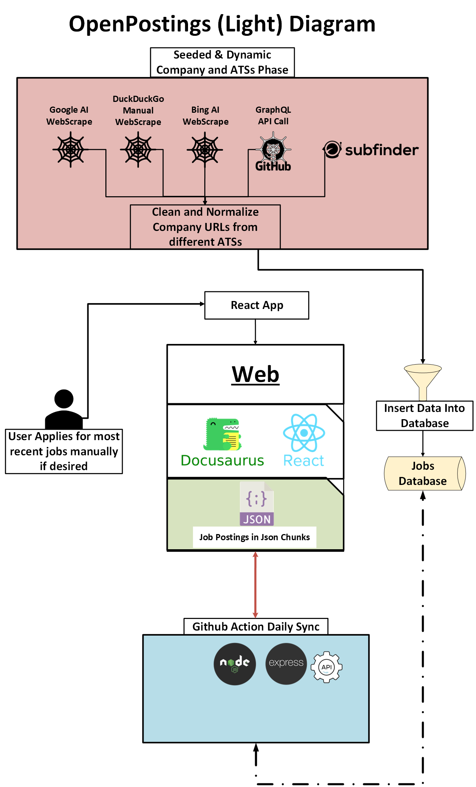
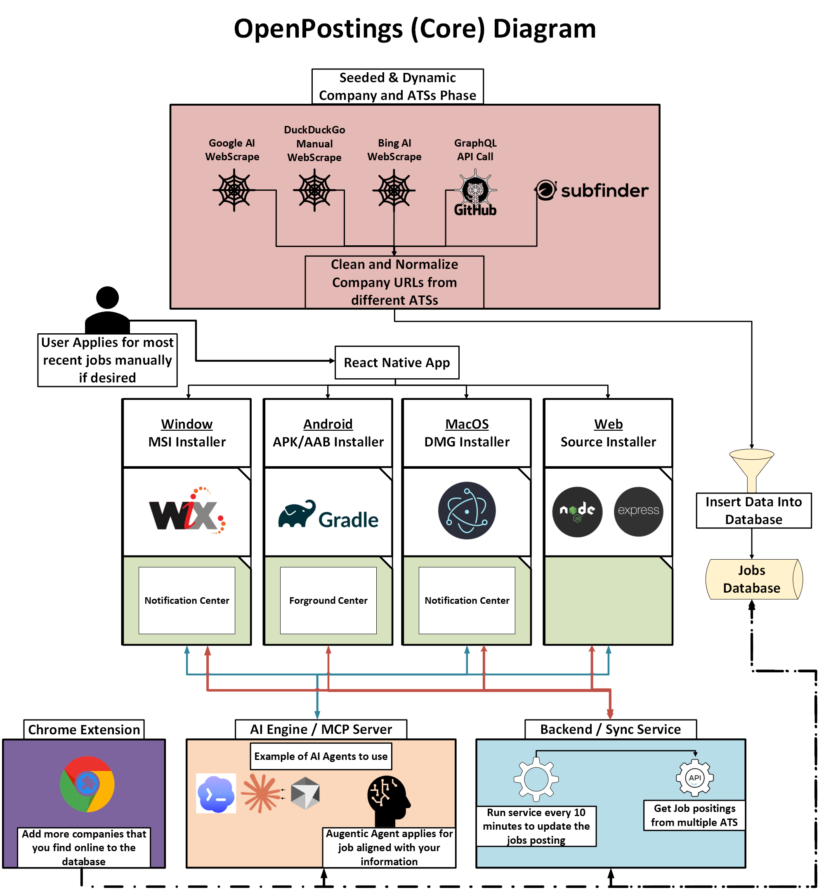

# OpenPostings


## Table of Contents

- [OpenPostings](#openpostings)
- [Youtube Video](#youtube-video)
- [Diagram](#diagram)
- [Features](#features)
- [Supported ATS](#supported-ats)
- [Docs](#docs)
- [Android Install from Google PlayStore (In Beta Coming Soon...)](#android-install-from-google-playstore-in-beta-comming-soon)
- [Android Phone/Device DIRECT Install](#android-phonedevice-direct-install-easiest-setup-but-still-wip-and-may-have-some-bugs)
- [Windows Installer Setup (Windows 10/11)](#windows-installer-setup-windows-1011-easiest-setup-but-still-wip-and-may-have-some-bugs)
- [MacOS Direct Install](#macos-direct-install-there-will-never-be-a-playstore-version-as-apples-garden-wall-requires-100-soul-bucks-every-year-just-for-a-free-app-this-its-outside-of-scope-of-an-opensource-application)
- [Source Installation Setup](#source-installation-setup-best-stability--compatibility)
  - [Requirements](#requirements)
  - [Installation](#installation)
  - [Quick Start (Web)](#quick-start-web)
- [Docker (Self-Hosted / Reverse Proxy)](#docker-self-hosted--reverse-proxy)
  - [Option A — GHCR Pre-built Image (Recommended)](#option-a--ghcr-pre-built-image-recommended)
  - [Option B — Build Locally](#option-b--build-locally)
  - [Reverse Proxy Setup](#reverse-proxy-setup)
  - [Keeping Your Data](#keeping-your-data)
  - [Updating](#updating)
- [Chrome Extension](#chrome-extension-for-capturingadding-more-companies-to-your-app)
  - [Load as Unpacked Extension](#load-as-unpacked-extension)
  - [Run Backend + Extension](#run-backend--extension)
  - [Example Supported Seeded URL Patterns](#example-supported-seeded-url-patterns)
  - [Troubleshooting](#troubleshooting)
- [REST API (Summary)](#rest-api-summary)
- [MCP Apply Agent Server](#mcp-apply-agent-server)
- [Security Notes](#security-notes)

<br/>
OpenPostings is an OpenSource ATS job aggregator and application tracking app. **It pulls jobs that were posted in the last 24 hours** or that has no posted date.

Over **110000+** companies from multiple ATSs all sourced into 1 location!

Over **THOUSANDS** fresh jobs on average **DAILY**!

## Youtube Video
[](https://www.youtube.com/watch?v=5sVIhhwx3Yk)

## Diagram (Light)


## Diagram (Core)


## Features

It combines:
- A React Native client (`Web`, `Android`, `Windows`)
- A local Node/Express API
- A local SQLite database
- An MCP apply-agent server for agent-assisted workflows

- Pulls jobs from **multiple ATS** providers into one local database.
- Filters postings by **search text, ATS, industry, region (AMER/EMEA/APAC), country, state, county, and remote mode**.
- Tracks **applied/ignored** posting state and application lifecycle status.
<br>

<br>

- Stores applicant profile and MCP agent settings in SQLite.
- Exposes MCP tools for **candidate selection, cover-letter drafting, and result recording.**

## Supported ATS

Current sync support includes:

- `ADP MyJobs`
- `ADP Workforce Now`
- `ApplicantAI`
- `ApplicantPro`
- `ApplyToJob`
- `Ashby`
- `BambooHR`
- `BrassRing`
- `BreezyHR`
- `CareerPlug`
- `CareerPuck`
- `CareersPage`
- `Dayforce`
- `Eightfold`
- `Fountain`
- `Freshteam`
- `Gem`
- `Getro`
- `Greenhouse`
- `Hirebridge`
- `HRMDirect`
- `iCIMS`
- `JobAps`
- `Jobvite`
- `JOIN`
- `Lever`
- `Loxo`
- `Manatal`
- `Oracle Cloud`
- `PageUp`
- `Paylocity`
- `PeopleForce`
- `PinpointHQ`
- `RecruitCRM`
- `Recruitee`
- `Rippling`
- `SageHR`
- `SAP HR Cloud`
- `Simplicant`
- `Talentlyft`
- `TalentReef`
- `Taleo`
- `Talexio`
- `Teamtailor`
- `The Applicant Manager`
- `UltiPro`
- `Workday`
- `Zoho`
- `governmentjobs`
- `smartrecruiters`
- `hibob`
- `isolvisolvedhire`
- `policeapp`
- `usajobs`
- `k12jobspot`
- `schoolspring`
- `calcareers`
- `calopps`
- `statejobsny`
- `PaycomOnline`
- `AgileHR`
- `Avature`
- `Comeet`
- `FactorialHR`
- `Hireology`
- `Crelate`
- `HiringPlatform`
- `Homerun`
- `JibeApply`
- `Jobs2Web`
- `Occupop`
- `PeopleAdmin`
- `Personio`
- `Recruiterflow`
- `Softgarden`
- `Trakstar`
- `UKG`
- `YCombinator`
- `Yello`
- `EdJoin`
- `Webcruiter`
- `AcademicJobsOnline`
- `prismhr`
- `silkroad`
- `paycor`
- `snaphunt`
- `dover`
- `oorwin`

<br>


OVER **110000+** companies in total. All gathered from search engine data like Google and DuckDuckGo and also using subdomain searching techniques and directory searching techniques.
<br>

<br>
It pulls in new job data at random from companies and stores it in the database. If the posting has lasted longer than 24 hours in the database its no longer used/deleted.

## Docs
- Docs: https://masterjx9.github.io/OpenPostings/docs/intro

## Android Install from Google PlayStore (Easiest Setup)
If you are interested in being a beta tester follow the Google Form here:

- https://play.google.com/store/apps/details?id=com.jatonjustice.openpostings&hl=en_US

## Android Phone/Device DIRECT Install
You can download the latest app from the github releases page and run it.

- https://github.com/Masterjx9/OpenPostings/releases/download/v2.0.1/app-release.apk

## Windows Installer Setup (Windows 10/11) (Easiest Setup But Still WIP and may have some bugs)
Download the latest installer from the github releases page and run it. It will guide you through installation and setup.
- https://github.com/Masterjx9/OpenPostings/releases/download/v2.0.1/openpostings-2.0.1-x64.msi

Choose the setup type during install:
- `Typical`: Installs the standard OpenPostings app setup (Includes the backend service worker, recommended for most users).
- `Complete`: Installs all available OpenPostings features. (Includes the backend service worker and MCP apply agent server, which may not be needed for all users).
- `Custom`: Lets you choose exactly which features to install (for example, whether to include the backend service worker and MCP apply agent server).


Once the installation is complete, you can launch OpenPostings from the start menu.

## MacOS Direct Install (There will never be a playstore version as Apple's Garden wall requires 100 soul bucks every year just for a free app, this its outside of scope of an opensource application)
You can download the lastest app from the github releases page and run it.

- https://github.com/Masterjx9/OpenPostings/releases/download/v2.0.1/openpostings-2.0.1-universal.dmg

## Source Installation Setup (Best Stability & Compatibility)

### Requirements

- Node.js 18+ and npm
  - https://docs.npmjs.com/downloading-and-installing-node-js-and-npm
- For Windows target: React Native Windows prerequisites
  - https://microsoft.github.io/react-native-windows/
- For Android target: Android Studio/emulator or device
  - https://developer.android.com/studio

### Installation

```powershell
cd OpenPostings
npm install
```

### Quick Start (Web)

Terminal 1:

```powershell
cd OpenPostings
npm run server
```

Terminal 2:

```powershell
cd OpenPostings
npm run web
```

Access the Web UI
- `http://localhost:8081`

Default API base URL behavior:
- Web/Windows: `http://localhost:8787`
- Android (on-device backend): `http://127.0.0.1:8787`

### You can run this Windows or Android as well!

```powershell
npm run windows (For windows)
npm run android (For Android)
```

## Docker (Self-Hosted / Reverse Proxy)

Run OpenPostings on a server or homelab using Docker. The setup splits into
two containers — one for the Expo web frontend and one for the Express API —
both using the same image.

> **Note:** The API URL is baked into the Expo bundle at build time by Metro,
> not at container startup. Passing `EXPO_PUBLIC_API_BASE_URL` as a Docker env
> var alone will not work — it must be set before the bundle compiles.
> For local use the default `http://localhost:8787` works fine. For reverse
> proxy deployments pass your public API URL at build time (see Option B).

---

### Option A — GHCR Pre-built Image (Recommended)

A pre-built image is available on GitHub Container Registry — no build step
required. Best for local deployments using the default API URL.

```bash
# Pull the latest image
docker pull ghcr.io/variablenix/openpostings:latest

# Create data directory and DB file
mkdir -p ./data && touch ./data/jobs.db

# Start both containers
docker compose -f docker-compose.example.yml up -d
```

Then open `http://localhost:3001` and hit **Sync Postings**.

> The pre-built image uses `http://localhost:8787` as the default API URL.
> If you are running behind a reverse proxy with a public-facing API URL,
> use Option B to build a custom image with your URL baked in.

---

### Option B — Build Locally

Use this if you need a custom API URL baked in (reverse proxy, remote server,
Cloudflare Tunnel, etc.) or if you want to build from source.

**Before you build — two things to know:**

1. **Debian Trixie is required as the base image.** The `sqlite3` native addon
   requires glibc 2.38+. Standard Node.js images use Debian Bookworm (glibc
   2.36) and will fail at runtime with `ERR_DLOPEN_FAILED`. The provided
   `Dockerfile` uses `node:20-trixie-slim` which has glibc 2.38 and just works.

2. **The API URL must be set at build time.** The variable name is
   `EXPO_PUBLIC_API_BASE_URL` — note the `_BASE` suffix. Using
   `EXPO_PUBLIC_API_URL` without it will not work.

```bash
# Local deployment (default API URL)
bash docker-build.sh

# Behind a reverse proxy (API URL baked in at build time)
bash docker-build.sh https://your-api.example.com

# Create data directory and DB file
mkdir -p ./data && touch ./data/jobs.db

# Start both containers
docker compose -f docker-compose.example.yml up -d
```

Then open `http://localhost:3001` and hit **Sync Postings**. The first sync
crawls all ATS sources and takes a while — it runs server-side so you can
close the browser tab and come back later.

---

### Reverse Proxy Setup

You'll need two upstream entries pointing at the same host:

| Host | Upstream | Purpose |
|---|---|---|
| `postings.example.com` | `http://localhost:3001` | Frontend UI |
| `postings-api.example.com` | `http://localhost:8787` | API |

---

### Keeping Your Data

Job data is stored in `jobs.db` inside the `openpostings-api` container at
`/app/jobs.db`. The example compose file bind-mounts it to `./data/jobs.db`
on the host so it survives container restarts. Skip this and you'll need to
resync from scratch every time you recreate the container.

---

### Updating

**Option A (GHCR image):**
```bash
docker compose -f docker-compose.example.yml pull
docker compose -f docker-compose.example.yml up -d --force-recreate
```

**Option B (local build):**
```bash
git pull
bash docker-build.sh        # add your API URL if using a reverse proxy
docker compose -f docker-compose.example.yml up -d --force-recreate
```

---

## Chrome Extension (For Capturing/Adding more companies to your app)

This repo includes a Chrome extension at:

- `chrome-extension/openpostings-seeded-url-capture`

It captures the active tab URL and submits it to OpenPostings as a **seeded ATS company source**.
Dynamic ATS sources are intentionally blocked.

### Load as Unpacked Extension

1. Open `chrome://extensions`.
2. Enable `Developer mode`.
3. Click `Load unpacked`.
4. Select `OpenPostings/chrome-extension/openpostings-seeded-url-capture`. (The folder where the chrome extension is)

### Run Backend + Extension

1. Start backend:

```powershell
cd OpenPostings
npm run server
```

NOTE: Or if you are using the Windows MSI installer version, just have your backend service set to `running`.

2. Open a seeded ATS company board URL in Chrome.
3. Open the extension popup.
4. Confirm/edit:
   - Backend API URL (default `http://localhost:8787`)
   - Source URL and company name
5. Click `Add to OpenPostings`.

### Example Supported Seeded URL Patterns

- Workday: `https://<subdomain>.wd*.myworkdayjobs.com/<companyPath>`
- Ashby: `https://jobs.ashbyhq.com/<orgSlug>`
- Greenhouse: `https://job-boards.greenhouse.io/<boardToken>` or `https://boards.greenhouse.io/<boardToken>`
- Lever: `https://jobs.lever.co/<organization>`
- iCIMS: `https://<tenant>.icims.com/jobs/search?...`
- BambooHR: `https://<tenant>.bamboohr.com/careers`
- Jobvite: `https://jobs.jobvite.com/<companySlug>/jobs`
- It works for all 80+ ATSs!

### Troubleshooting

- `Failed to fetch`:
  - Ensure backend is running at `http://localhost:8787`.
  - If backend runs elsewhere, update backend URL in the extension popup.
- `URL does not match a supported seeded ATS company source`:
  - The current page is likely not a seeded ATS company board URL.
- `Dynamic ATS URLs are not supported`:
  - Expected behavior. This extension only inserts seeded ATS company sources.

## REST API (Summary)

Core:

- `GET /health`
- `GET /sync/status`
- `POST /sync/ats` (`?wait=1` optional)
- `POST /sync/workday` (alias route)

Postings:

- `GET /postings`
- `GET /postings/filter-options`
- `POST /postings/ignore`

Applications:

- `GET /applications`
- `POST /applications`
- `PATCH /applications/:id`
- `DELETE /applications/:id`

Settings:

- `GET /settings/personal-information`
- `PUT /settings/personal-information`
- `GET /settings/mcp`
- `PUT /settings/mcp`
- `GET /settings/sync`
- `PUT /settings/sync`
- `GET /settings/export`
- `GET /extension/seeded-source/options`
- `POST /extension/seeded-source/classify`
- `POST /extension/seeded-source/upsert`

MCP helper endpoints:

- `GET /mcp/candidates`
- `POST /mcp/cover-letter-draft`
- `POST /mcp/applications/complete`

## MCP Apply Agent Server

You can have Codex/Claude/Gemini/Qwen/LLMs do the following for you:
- Get your applicantee information `get_applicant_context`
- Find the latest relevant jobs for you. `find_posting_candidates`
- Apply to those jobs (As long as your LLM model has access to a browser)
- Build a dynamic cover letter for you that relates to your resume, experience and the job you are applying for. `draft_cover_letter`
- Update job application tracking for you. `record_application_result`

To turn on the MCP server so your model can interact with OpenPostings run:

```powershell
cd OpenPostings
npm run mcp:apply-agent
```

MCP server setup for your Codex (If you use a different LLM, ask it to setup an MCP setup for you):
```
[mcp_servers.openpostings-apply]
command = "node"
args = ['C:\Users\<path to where you cloned the repo>\OpenPostings\server\mcp-apply-server.js']
```

## Security Notes

This is designed for local/self-hosted usage.

- MCP credentials/settings are stored in local SQLite fields.
- If you need stricter controls, add OS-level secret storage, DB encryption-at-rest, and tighter filesystem permissions.
